<a id="top"></a>

<picture>
  <source media="(prefers-color-scheme: dark)" srcset="./assets/hero-dark.svg">
  <source media="(prefers-color-scheme: light)" srcset="./assets/hero-light.svg">
  
</picture>

<br>

Proste projekty z zakresu sztucznej inteligencji, opracowane w języku polskim. Projekty znajdują się na osobnych gałęziach repozytorium — każda gałąź zawiera notatnik Jupyter, raport PDF i opis projektu.

<br>

## Projekty

<a href="https://github.com/FilipTw/AI_Projects_In_Polish/tree/Project_01">
<picture>
  <source media="(prefers-color-scheme: dark)" srcset="./assets/tile-01-dark.svg">
  <source media="(prefers-color-scheme: light)" srcset="./assets/tile-01-light.svg">
  
</picture>
</a>

<br>

<a href="https://github.com/FilipTw/AI_Projects_In_Polish/tree/Project_02">
<picture>
  <source media="(prefers-color-scheme: dark)" srcset="./assets/tile-02-dark.svg">
  <source media="(prefers-color-scheme: light)" srcset="./assets/tile-02-light.svg">
  
</picture>
</a>

<br>

<a href="https://github.com/FilipTw/AI_Projects_In_Polish/tree/Project_03">
<picture>
  <source media="(prefers-color-scheme: dark)" srcset="./assets/tile-03-dark.svg">
  <source media="(prefers-color-scheme: light)" srcset="./assets/tile-03-light.svg">
  
</picture>
</a>

<br>

<a href="https://github.com/FilipTw/AI_Projects_In_Polish/tree/Project_04">
<picture>
  <source media="(prefers-color-scheme: dark)" srcset="./assets/tile-04-dark.svg">
  <source media="(prefers-color-scheme: light)" srcset="./assets/tile-04-light.svg">
  
</picture>
</a>

<br>

<a href="https://github.com/FilipTw/AI_Projects_In_Polish/tree/Project_05">
<picture>
  <source media="(prefers-color-scheme: dark)" srcset="./assets/tile-05-dark.svg">
  <source media="(prefers-color-scheme: light)" srcset="./assets/tile-05-light.svg">
  
</picture>
</a>

<br>

<a href="https://github.com/FilipTw/AI_Projects_In_Polish/tree/Project_06">
<picture>
  <source media="(prefers-color-scheme: dark)" srcset="./assets/tile-06-dark.svg">
  <source media="(prefers-color-scheme: light)" srcset="./assets/tile-06-light.svg">
  
</picture>
</a>

<br>

| | Projekt | Gałąź |
|:--:|:--|:--|
| **01** | [Emisja CO₂ — modele klasyczne kontra sieć MLP](https://github.com/FilipTw/AI_Projects_In_Polish/tree/Project_01) | `Project_01` |
| **02** | [CIFAR-10 — sieci konwolucyjne](https://github.com/FilipTw/AI_Projects_In_Polish/tree/Project_02) | `Project_02` |
| **03** | [Skalowanie cech — standaryzacja i min-max](https://github.com/FilipTw/AI_Projects_In_Polish/tree/Project_03) | `Project_03` |
| **04** | [Boston Housing — Ridge, Lasso i ElasticNet](https://github.com/FilipTw/AI_Projects_In_Polish/tree/Project_04) | `Project_04` |
| **05** | [Regresja logistyczna — Titanic i Iris](https://github.com/FilipTw/AI_Projects_In_Polish/tree/Project_05) | `Project_05` |
| **06** | [Klasteryzacja — segmentacja obrazu i analiza skupień](https://github.com/FilipTw/AI_Projects_In_Polish/tree/Project_06) | `Project_06` |

<br>

## Uruchomienie

```bash
git clone --branch Project_01 --single-branch https://github.com/FilipTw/AI_Projects_In_Polish.git
cd AI_Projects_In_Polish
pip install numpy pandas scikit-learn matplotlib seaborn tensorflow jupyter
jupyter notebook
```

<br>

---

<sub>Autor: [Filip Twardawa](https://github.com/FilipTw) &nbsp;·&nbsp; Licencja [MIT](LICENSE) &nbsp;·&nbsp; [Do góry ↑](#top)</sub>
